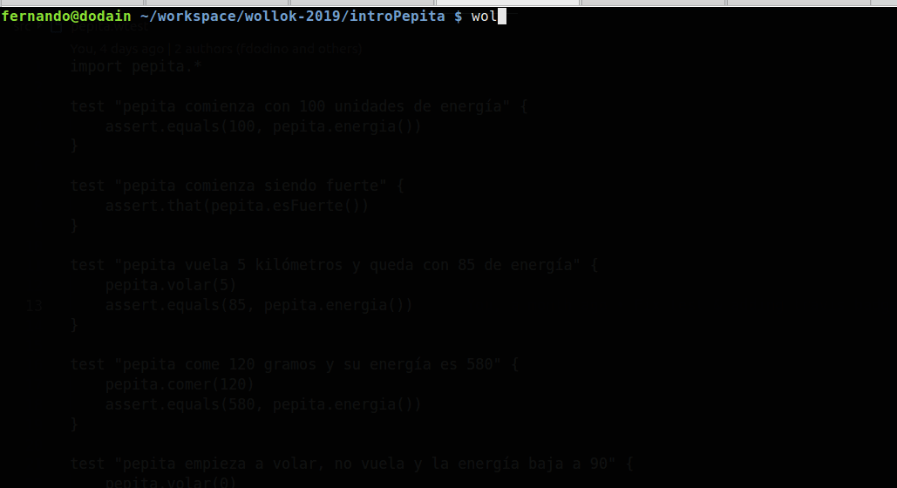

<image src="./images/wollokCLILogo2.png" height="20%" width="20%"/>

<!-- http://patorjk.com/software/taag/#p=display&f=Larry%203D&t=cli -->

# Wollok Command-Line Interface Project

[](https://travis-ci.org/uqbar-project/wollok-cli)

The main purpose of this project is to provide a command line interface (CLI) for Wollok developers & users, in order to foster any kind of automation (like CI workflow or developing bash scripts). [Wollok](http://www.wollok.org/en/) is a pedagogical tool for teaching object-oriented programming, and it is IDE based. Although, you can also run checker, interpreter and interactive console without a graphical user interface.

## Installation

If you want to use it in your computer,

- you must have a Linux-like operating system
- clone this repo into any local folder
- and add that local folder to your PATH environment variable (and into your bash profile)

```bash
export PATH="$PATH:<<pathWhereThisRepoWasCloned>>"
```

Then you can move to any other folder and use all executable bash files, as explained below.

## Scripts

The root folder provides all Wollok bash commands:

- **wollok test & wollok run**: runs all the test/programs from the current folder (see below)
- **repl**: invoke Wollok interactive REPL console, using an optional .wlk file
- **check**: builds and validates any wollok file
- **ast**: outputs the current Abstract Syntax Tree, according to Wollok grammatical rules.
- you'll also find Wollok server scripts.

Here's an example of running

- all tests from a project,
- all programs from a project,


And a second demo

- running interactive console without any file,
- running interactive console using **pepita**, our main character for the very first example in Wollok,
- checker for **pepita.wlk**  (since no output was given all tests passed succesfully),
- and AST analyzer for **pepita.wlk** and saving output into a file



### `jars` folder

In `jars` folder we put all necessary Java jar files in order to run in a standalone computer without installing the whole Wollok development environment.

## Travis integration & scripts

- **wollok test**
- **wollok run**

are suitable for using it in Travis scripts. They both start **building all .wlk files**, so even if your tests are passing or your program is working fine, ensure you have no errors in `Problems` tab (in your Wollok IDE).


Otherwise, your build will fail.

It then will run either all the tests files or all the programs. Any kind of error prevents a succesful build to happen.

An example of Travis output:


### Example 1: running tests in a Wollok Project

If your Wollok project has several test files, your `.travis.yml` should look like this:

```yml
language: generic

sudo: required

script:
    - git clone https://github.com/uqbar-project/wollok-cli
    - export PATH="$PATH:./wollok-cli"
    - wollok test
```

### Example 2: running a program inside a Wollok Project

If your Wollok project has no test file but a program, then your `.travis.yml` should look like this:

```yml
language: generic

sudo: required

script:
    - git clone https://github.com/uqbar-project/wollok-cli
    - export PATH="$PATH:./wollok-cli"
    - wollok run
```

Or, if you have both programs and tests, you could simply do a

```yml
language: generic

sudo: required

script:
    - git clone https://github.com/uqbar-project/wollok-cli
    - export PATH="$PATH:./wollok-cli"
    - wollok run && wollok test
```

## Testing Wollok CLI: Sanity check

Having https://github.com/wollok/introPepita as a witness case, these are the test cases:

- [x] `pepita.wlk` not compiling => build failed
- [x] missing import `pepita.*` in test file => build failed
- [x] validator errors in `pepita.wlk` like having a constructor in an object definition => build failed
- [x] tests failing with assertion errors => build failed
- [x] test failing with runtime errors (like `division by zero` or `null` parameters in operations like `+`) => build failed
- [x] passing tests => build passed
- [x] warning issues in `pepita.wlk` (but no errors) => build passed

## Updating to a new version of Wollok

Whenever Wollok has a new stable release, you can update all jars from `jars` folder running `generateCI.sh` script. You must provide just one argument, the location of root Wollok development environment folder.

For example, if you have this folder structure:

```
  |- wollok-cli
     |- generateCI script bash file
  |   ...
  |- wollok-dev
     |- wollok
        |- wollok development environment files ...
  |-
```

This is the way you should call the script:

```bash
generateCI.sh ../wollok-dev/wollok
```

Or, if you are in `wollok-dev/wollok` folder, simply run

```bash
generateCI.sh .
```

Don't add the trailing `/` character for wollok root folder. After running the script, you can tests if everything went smooth:

```bash
wsanity-check.sh
```

## Another useful scripts

They are all in `util` folder:

- **cloneAllProjects.sh**: clones all projects from Wollok organization

## Adding Travis to whole repository

If you want to add `.travis.yml` to all projects in a single organization (for example, `wollok`), you can use this scripts in `util` folder:

- **cloneAllProjects.sh**: for cloning all repos in a single organization
- **addTravisInAllProjects.sh**: searches for `.travis.yml` files in each project and adds the corresponding (tests or programs), and also adds Travis badge to README.md (creating or appending to an existing README file)
- **pushingAllTravis.sh**: pushes all changes into Github repositories again

## Future steps

- See the [current opened issues](https://github.com/uqbar-project/wollok-cli/issues)
- Migrate to Wollok Server Architecture in Amazon?

___

<div style="width: 100%; text-align: center; margin: auto;">
    <image src="./images/uqbarLogo.png" height="3%" width="3%"/> - <i>Powered by Uqbar</i> - http://www.uqbar.org
</div>
